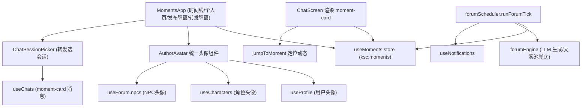

# 朋友圈完整功能 — 技术设计

Feature Name: moments-full
Updated: 2026-10-02

## Description

在现有朋友圈模块（store/moments.ts + components/moments/MomentsApp.tsx + forumScheduler 互动调度）基础上补齐 18 项需求：头像通连、9 图发布与折叠、点赞头像列表、楼中楼评论、删除确认、转发到聊天（含角色回应）、可配置频率的角色定时发圈（文案池兜底）、角色自动互动、NPC 评论区生态、互动延时展示、悬浮发布按钮、个人朋友圈页、访客记录、音乐卡片、已发布可编辑。

纯前端实现，无后端。数据持久化沿用 zustand persist（localStorage，前缀 `ksc:`）+ IndexedDB（图片）。

## Architecture



数据流：
- 发布/点赞/评论/编辑/删除：UI → useMoments → persist 自动落 localStorage。
- 角色互动：forumScheduler tick → 挑选互动者（角色+NPC）→ forumEngine 生成内容（LLM 失败走文案池）→ useMoments 落库 → 通知。
- 转发：MomentsApp → 选择会话 → useChats.addMessage(type='moment-card') → 调度器安排角色回应（聊天回复 + 可选点赞）。

## Components and Interfaces

### 1. store/moments.ts（改造）

```ts
interface MomentComment {
  id: string
  author: MomentAuthor            // type: 'user' | 'character' | 'npc'
  content: string
  parentId: string | null         // 楼中楼：父评论 id
  replyToName: string | null      // 展示用
  time: number
}

interface Moment {
  // ...现有字段
  music: { title: string; artist: string } | null   // R17
  edited: boolean                                     // R18
  visitors: { type: 'character'; id: string; name: string; time: number }[]  // R15
}

// 新增/调整 actions
editMoment(id, content)                 // R18，仅文字
addComment(id, comment)                 // comment 含 parentId
recordVisitor(id, visitor)              // R15
toggleLikeNpc(id, key)                  // NPC 点赞（key 形如 'npc:<id>'）
```

点赞者键规则：用户 `'user'`，角色存 character.id（兼容存量数据），NPC 存 `'npc:<id>'`。

### 2. components/moments/AuthorAvatar.tsx（新增，R1）

统一作者头像组件：入参 `author: MomentAuthor`。内部解析：
- `type==='user'` → `useProfile.profile.avatarId`，昵称用 `displayUserName()`
- `type==='character'` → `character.avatarId`
- `type==='npc'` → `npc.avatarId`
- 无图 → 昵称首字占位（复用 chat/Avatar 的视觉样式）

MomentsApp、评论区、点赞头像列表、个人朋友圈页全部改用此组件；`MomentsApp` 内旧 `MomentAvatar` 删除。

### 3. components/moments/MomentsApp.tsx（改造）

- **视图状态**：`view: { kind: 'timeline' } | { kind: 'profile'; authorKey: string }`。点头像 → profile 视图；返回 → timeline。
- **悬浮按钮**：右下角 `position: fixed` 圆形按钮（R12），原顶部发布按钮移除。
- **图片网格**：≤4 张全展示；>4 张展示前 4 格 + "+N" 折叠格，点击展开为完整网格（R2）。
- **点赞区**：头像行（AuthorAvatar size 22 横排，最多 8 个）+ 总数（R3）。
- **评论区**：一级评论按 `parentId===null` 分组，楼中楼缩进渲染（R4）。每条一级评论带"回复"按钮，点击后输入框预填 `回复 @xxx：`。
- **删除**：`Modal` 确认框（复用 common），确认后 `removeMoment`（R5）。角色动态无删除入口。
- **编辑**：自己动态的菜单加"编辑"，弹窗仅改文字，保存调 `editMoment`，卡片显示"已编辑"（R18）。
- **音乐卡片**：卡片内渲染唱片封面占位 + 歌名 + 歌手行（R17）。
- **转发**：卡片"操作行"加转发入口 → `ForwardPickerModal` 列出 useChats 会话（含角色头像/昵称）→ 确认后 addMessage 并 toast（R6）。
- **个人朋友圈页**：头像/昵称头部 + 该作者全部动态（倒序）；作者为用户时额外渲染最近访客头像列表（R13/R15）。

### 4. store/chats.ts + ChatScreen.tsx（改造，R6）

- `MessageType` 增加 `'moment-card'`；`MessageData` 增加 `momentId?: string`。
- ChatScreen 消息渲染分支：moment-card 显示卡片（作者昵称、文字摘要 ≤60 字、首图缩略图、"朋友圈"角标）；点击 → `useUI.openApp('moments')` + `useMoments.getState().setJumpTo(momentId)`。
- 用户消息头像：`ChatScreen.tsx:527` 处 `avatarId={m.role === 'user' ? useProfile.getState().profile.avatarId : character.avatarId}`（组件内改用 useProfile hook 读取，遵守 selector 红线）。

### 5. lib/forumScheduler.ts（改造，R7/R8/R9/R10）

tick 优先级保持现有顺序，改动点：

1. **ambientMoment**（R7）：间隔改为按 `useChatParams` 新配置 `momentAutoFreq: 'off' | 'low' | 'medium' | 'high'` 映射（off=禁用，low=25~40min，medium=10~25min，high=5~12min）。LLM 不可用/失败时从内置文案池 `MOMENT_FALLBACK_POOL`（≥24 条通用短句，支持角色名插值）随机抽取。生成 imageDesc 后以文字描述附在内容尾部括号内（无图片生成 API，不产图）。
2. **用户动态互动**（R8/R9）：候选池 = 可见角色 + `forum.npcs` 中未被拉黑者，随机取 1~3 个；行为随机：点赞 / 一级评论 / 回复已有评论（楼中楼）。每个互动间隔 0.6~1.8s（延时展示 R10）。
3. **用户评论触发回复**（R8）：检测到用户新增评论（parentId 任意）且 2 分钟内无角色回应 → 被回复角色（或随机角色）以楼中楼回复。
4. **访客记录**（R15）：用户动态互动调度中，被考察但未行动的候选角色以 35% 概率 `recordVisitor`。
5. **转发回应**（R6）：新增 `respondToForward(sessionId, momentId)`：角色先用 1~2 条聊天消息评论该动态（复用 buildMomentCardContext 组装上下文），再以 50% 概率去点赞该动态。

### 6. store/chatParams.ts + ChatParamsPage（R7 配置 UI）

新增 `momentAutoFreq` 字段（默认 'medium'）+ `setMomentAutoFreq`。ChatParamsPage 增加分段选择器（关闭/悠闲/正常/高频），与主动消息设置同区块。

### 7. lib/momentFallback.ts（新增，R7）

内置文案池与抽取函数 `pickFallbackMoment(characterName: string): string`。模板含 `{name}` 插值，覆盖日常/情绪/天气/吐槽等类别。

## Data Models

```ts
// ksc:moments（zustand persist）
Moment {
  id: string
  author: { type: 'user' | 'character'; id: string; name: string }
  content: string
  imageIds: string[]                  // IndexedDB blob id，≤9
  visibility: 'all' | 'friends' | 'custom'
  visibleIds: string[]
  likes: string[]                     // 'user' | characterId | 'npc:<id>'
  comments: MomentComment[]           // parentId 楼中楼
  music: { title: string; artist: string } | null
  edited: boolean
  visitors: { type: 'character'; id: string; name: string; time: number }[]
  createdAt: number
}

// ksc:chats 新消息类型
{ type: 'moment-card', data: { momentId: string } }

// ksc:chat-params 新字段
momentAutoFreq: 'off' | 'low' | 'medium' | 'high'
```

向后兼容：存量 Moment 无 music/edited/visitors 字段 → 运行时按可选值处理（`m.music` 判空、`m.visitors ?? []`），不改 persist 版本号。

## Correctness Properties

1. **selector 红线**：所有 `useX((s) => ...)` 返回稳定引用；派生数据（分组评论、过滤列表）在组件体内 useMemo 计算。
2. **点赞幂等**：同一 authorKey 对同一动态至多出现一次在 likes 中。
3. **楼中楼约束**：comment.parentId 必须指向同一条动态内的既有评论；父评论被删除时其楼中楼一并删除。
4. **可见性闭环**：互动者候选必须通过 `visibleTo(moment, actorId)` 校验。
5. **调度互斥**：scheduler 单例 running 锁沿用，防重入。
6. **图片上限**：发布与编辑路径 imageIds 长度 ≤9。

## Error Handling

| 场景 | 处理 |
|------|------|
| LLM 生成朋友圈失败/超时 | 静默降级到文案池；文案池也失败则本轮跳过 |
| LLM 生成评论失败 | 该互动者本轮跳过，其余继续 |
| 转发目标会话已被删除 | ForwardPicker 打开时实时读取 useChats，渲染前过滤 |
| 转发的动态已被删除 | moment-card 渲染时显示"动态已删除"占位，点击无跳转 |
| 图片压缩/写入 IndexedDB 失败 | toast 提示单张失败，继续处理其余图片 |
| 编辑后内容为空且无图 | 阻止保存，toast 提示 |
| 访客/互动定时器与应用后台化冲突 | 沿用 tick 驱动（runForumTick 由全局定时器调用），无独立长定时器，无泄漏风险 |

## Test Strategy

1. **类型检查**：`cd /workspace/frontend && npx tsc -b` 零错误。
2. **构建**：`npm run build` 成功。
3. **无头冒烟**（playwright，参考 /tmp/opencode/smoke.mjs 思路）：
   - 解锁 → 打开朋友圈 → 发布文字动态 → 动态出现在时间线顶部
   - 点赞 → 取消点赞 → 数量回到 0
   - 评论 → 楼中楼回复 → 结构渲染正确
   - 删除 → 确认弹窗出现 → 确认后消失
   - 转发到首个会话 → 聊天中出现 moment-card
4. **持久化**：发布后刷新页面（page.reload），动态仍在。
5. **手工验证**：头像通连（主页改头像 → 聊天/朋友圈同步）、悬浮按钮、个人页、音乐卡片、编辑、频率配置生效。

## References

- 现有朋友圈存储：frontend/src/store/moments.ts
- 现有朋友圈 UI：frontend/src/components/moments/MomentsApp.tsx
- 调度器：frontend/src/lib/forumScheduler.ts
- 生成引擎：frontend/src/lib/forumEngine.ts
- 消息模型：frontend/src/store/chats.ts
- 头像组件：frontend/src/components/chat/Avatar.tsx
- 用户头像来源：frontend/src/store/profile.ts
- 用户消息头像写死 null 的位置：frontend/src/components/chat/ChatScreen.tsx:527
