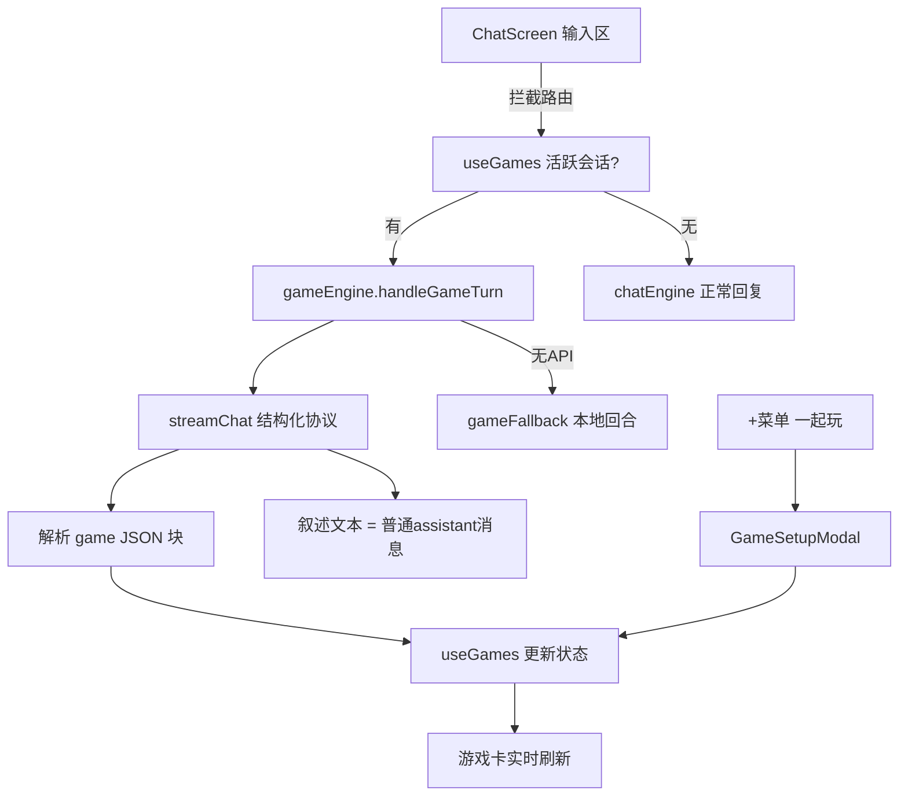

# 一起玩游戏中心（跑团 + 海龟汤）技术设计

Feature Name: game-center
Updated: 2026-10-06
Status: approved

## Description

聊天内嵌的文字游戏系统。复用现有聊天流（消息混排）、LLM 通道（streamChat + 角色人设注入）、zustand persist 持久化模式。核心是「游戏会话状态机 + LLM 结构化输出协议 + 游戏卡消息」，跑团与海龟汤是同一引擎的两个模板。后续玩法（密室/接龙/平行世界）只需新增模板与少量状态字段。

## Architecture



- 游戏叙述以普通 assistant 文本消息追加进聊天流（保证上下文连贯、可回看）；机器状态存 games store；游戏卡消息只持有 gameId 并实时从 store 渲染。
- 跑团骰子由本地 `1d20` 掷出后传给 LLM 判定成败并叙事（LLM 不产生随机数）。
- 降级模式：`gameFallback.ts` 提供本地事件池（跑团 12+ 条）、海龟汤谜题池（6+ 题带关键词判定表）。

## Components and Interfaces

### 1. `src/store/games.ts`（新建，zustand persist，键 `ksc:games`）

```ts
export type GameType = 'trpg' | 'turtle'
export type GameStatus = 'playing' | 'paused' | 'ended'

export interface TrpgState {
  world: string;        // 世界观描述
  role: string;         // 玩家身份
  act: string;          // 当前幕/场景名
  scene: string;        // 当前场景一句话
  hp: number;           // 生命 0-10
  items: string[];      // 持有物
  flags: Record<string, boolean>;
  progress: number;     // 0-100
}

export interface TurtleQA { q: string; verdict: 'yes' | 'no' | 'irrelevant' | 'close'; at: number }
export interface TurtleState {
  puzzle: string;       // 汤面
  truth: string;        // 汤底（对玩家保密）
  difficulty: 'easy' | 'normal' | 'hard';
  qa: TurtleQA[];
  hints: number;        // 已用提示 (max 3)
  solved: boolean;
  revealed: string;     // 结束时公布的完整汤底
}

export interface GameSession {
  id: string;
  type: GameType;
  chatId: string;         // 所属聊天会话
  characterId: string;
  status: GameStatus;
  createdAt: number;
  updatedAt: number;
  turn: number;           // 已进行回合数
  trpg?: TrpgState;
  turtle?: TurtleState;
  ending?: string;        // 结局摘要（ended 时）
  cardMsgId?: string;     // 游戏卡消息 id，用于更新卡片
  log: { at: number; who: 'player' | 'gm'; text: string }[];  // 精简事件日志（最近 40 条）
}
```

Store actions: `createGame(input): GameSession`、`patchState(id, patch)`、`pushLog(id, who, text)`、`setStatus(id, status)`、`endGame(id, ending)`、`removeGame(id)`、`getActiveByChat(chatId): GameSession | undefined`。

### 2. `src/lib/gameEngine.ts`（新建，核心引擎）

导出：
- `startGame(chatId, character, type, config)` — 组装开场提示词 → `streamChat` → 解析 JSON 块 → 写入初始状态 → 返回开场叙述文本。
- `handleGameTurn(chatId, character, userText)` — 读活跃会话 → 跑团先本地掷骰 → 组装回合提示词（人设 + 规则 + 当前状态 JSON + 最近 log + 玩家输入）→ `streamChat` → 解析 → 更新状态 → 返回叙述。
- `buildGameSystemPrompt(session, characterName, persona)` — 按类型返回规则模板。**协议约定 LLM 回复格式**：

````
（叙述正文，2-5 段，角色口吻）
```game
{"hp":7,"act":"第二章","scene":"地窖深处","items":["火把"],"flags":{"doorOpen":true},"progress":45,"ending":null}
```
````
海龟汤 JSON：`{"verdict":"yes|no|irrelevant|close","hint":"...","solved":false,"revealed":null}`。
解析函数 `parseGameBlock(raw)`：取最后一个 ```game 围栏，`JSON.parse` 容错（失败则视作纯叙述、状态不变）。
- `trpgPresets`：5 个世界模板 `{id, name, world, role, hp, items}`。
- 海龟汤难度注入：hard 汤底需 3 层反转；easy 单层因果。

### 3. `src/lib/gameFallback.ts`（新建，降级文案池）

- `FALLBACK_TRPG_EVENTS: string[]`（12+ 条通用事件模板，含进度推进）。
- `FALLBACK_TURTLES: {puzzle, truth, keywords: string[]}[]`（6+ 题）。判定规则：提问包含关键词 → yes；包含反义关键词 → no；其余 → irrelevant。
- `localTurn(session, userText)` / `localTurtleTurn(session, userText)` 纯函数。

### 4. `src/store/chats.ts`（修改 2 处）

- 行 4 `MessageType` 联合类型追加 `'game-card'`。
- 行 8 `MessageData` 追加 `gameId?: string`。

### 5. `src/components/games/GameSetupModal.tsx`（新建）

底部弹层（复用 ChatScreen 内其他弹层的遮罩样式）。两步：选类型 → 按类型给模板选择/世界观输入/难度；确认后调用 createGame + startGame。

### 6. `src/components/games/GameCardBubble.tsx`（新建）

按消息 `data.gameId` 从 store 取会话渲染：
- playing：类型徽标 + 场景/进度条/hp/道具（跑团）或已提问标记列表 + 要提示（海龟汤）+ 暂停/结束按钮。
- paused：摘要 + 「继续」按钮。
- ended：结局摘要 + 删除按钮。
样式沿用 moments 卡片风格（圆角、var(--text-*) 颜色变量）。

### 7. `src/components/chat/ChatScreen.tsx`（修改）

- 加号面板（约行 846-856 的 PlusAction 列表）追加「一起玩」入口（图标用 lucide `Dices`），点击 `setGameSetupOpen(true)`；线下模式下与图片/语音同样隐藏。
- 消息渲染分支（参照行 1460 `moment-card` 分支）追加 `game-card` → `<GameCardBubble />`。
- 发送路由（参照行 200-235 的发送逻辑）：发送前查 `getActiveByChat(sessionId)`，命中且状态 playing 且消息非 OOC 前缀 → `gameEngine.handleGameTurn`；OOC 或暂停时走原逻辑。输入区上方渲染「游戏中·点击暂停」胶囊。
- 状态：`gameSetupOpen`、游戏回合期间沿用现有 loading/typing 指示。

## Data Models

见上方 store 定义。持久化：zustand `persist` 键 `ksc:games`，无需 migrate（新 store）。

## Correctness Properties

1. 游戏卡渲染永远来自 store 单一数据源，卡片消息本身不存状态（可安全删除重放）。
2. 任意时刻一个 chatId 至多一个 status='playing' 的会话。
3. 汤底 truth 仅存在于 store，聊天流任何消息文本中不以明文出现（开场叙述只含 puzzle）。
4. `parseGameBlock` 对缺失/畸形 JSON 幂等：状态不变、叙述照常入流。
5. 结束（progress>=100 / hp<=0 / solved / 手动结束）后 status='ended' 且路由恢复普通聊天。

## Error Handling

- streamChat 抛错（HTTP/网络）：系统消息提示「连接中断，回合未消耗」，状态回滚到回合前快照（handleGameTurn 内先浅拷贝 state，失败则 patchState 回滚）。
- JSON 块缺失：按纯叙述处理。
- 降级模式判定与模板缺字：全部走本地池，无网络依赖。
- 删除聊天会话时：遍历 games 删除 chatId 匹配的会话（ChatScreen.removeSession 处挂钩）。

## Test Strategy

- `npx tsc -b`（workdir /workspace/frontend）作为每任务验收。
- 手动冒烟（dev server 420x880）：创建跑团局→行动 3 回合→看进度变化→暂停→插嘴聊天→继续→结束；海龟汤：创建→提问 3 次→要提示→猜汤底。无 API 环境验证降级池。
- localStorage 检查 `ksc:games` 持久化。

## References

- 消息类型与持久化先例：`frontend/src/store/chats.ts:4`（MessageType）、`frontend/src/store/chats.ts:134`（persist 键）
- moment-card 渲染分支先例：`frontend/src/components/chat/ChatScreen.tsx:1460`
- 加号面板入口：`frontend/src/components/chat/ChatScreen.tsx:846`
- LLM 通道：`frontend/src/lib/api.ts:67`（streamChat）、`frontend/src/lib/chatEngine.ts:227`（generateCharacterReply）
- preset 解析：`frontend/src/components/chat/ChatScreen.tsx:127`（character.apiPresetId ? getPresetById : getDefaultChatPreset）
- 人设注入：`frontend/src/lib/chatEngine.ts:19`（buildCharacterPrompt）
- 引擎先例：`frontend/src/lib/momentEngine.ts`、`frontend/src/lib/smsEngine.ts`

## Handoff Protocol（跨会话接力约定）

- 唯一进度事实源：本目录 `tasklist.md`。每个任务完成即 `git add + commit + push`，并把对应任务状态改为 `[DONE]`、在 tasklist.md 末尾 Progress Log 追加一行。
- 接力方恢复步骤：`git pull --rebase origin main` → 读 tasklist.md 找第一个非 `[DONE]` 任务 → `cd /workspace/frontend && npx tsc -b` 确认基线通过 → 继续执行。
- 提交信息格式：`feat(game): T{n} {摘要}`。
